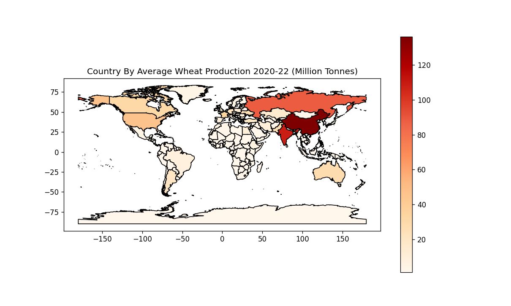
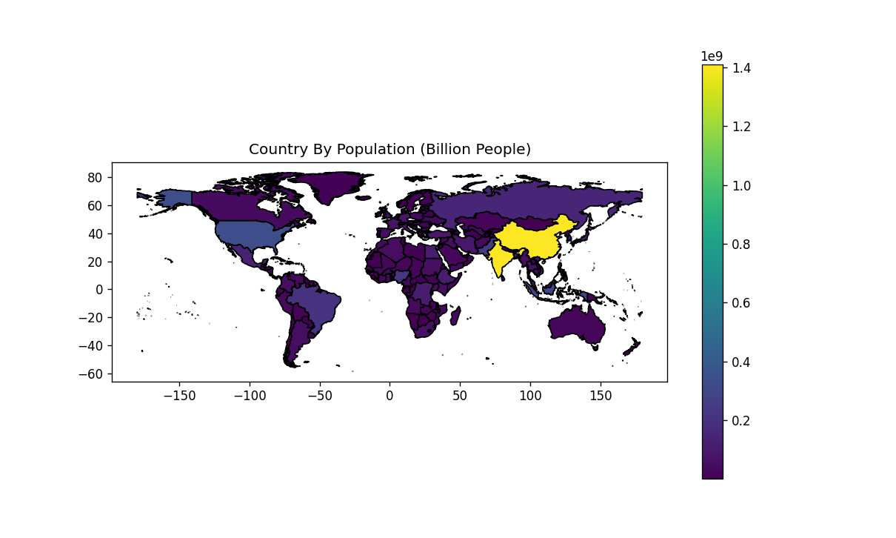
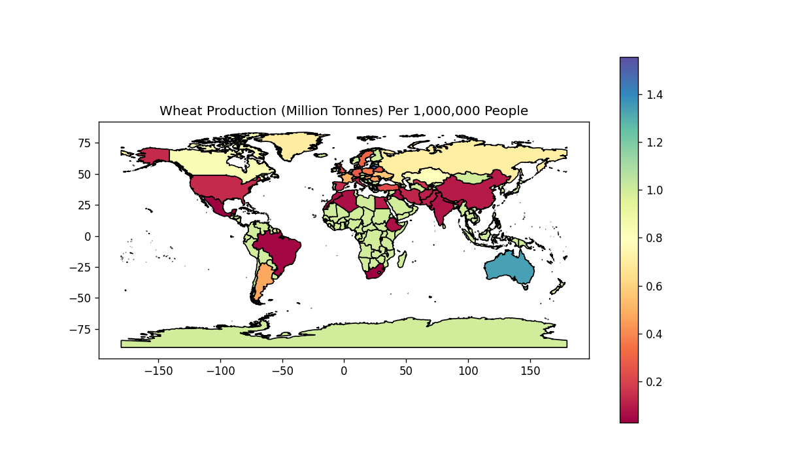
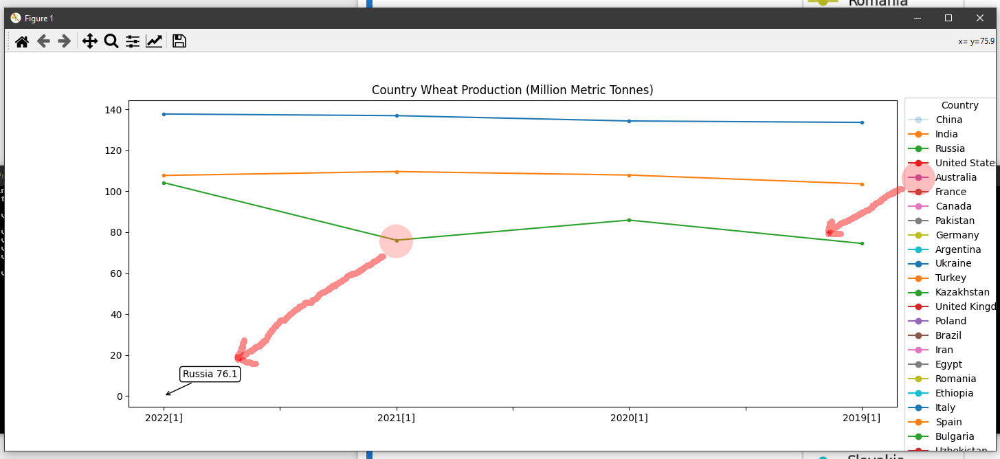

Three tasks each with their own jupyter notebook, including images of the results.  
Additional **BONUS** jupyter notebook showing interactive python version. requirements.txt allowing pip install on OSX and Windows
 
Task1_averageWheatByCountry.ipynb  
Task2_PopulationByCountry.ipynb  
Task3_WheatProductionPerMillion.ipynb  
BONUS.ipynb  
BONUS.py  

  
  
  
  

